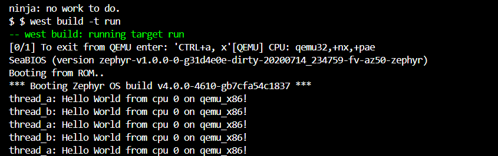

# Zephyr-Get-Started

The aim of the project is to set up a template where one could run application level code on a Zephy ecosystem using west tools. By default, it should be able to run on QEMU. But should contain instructions to extend it to other boards.

## Requirements

    1. Docker Desktop.
    
    Note.We are using Dev Containers so, Docker Desktop is all you need.

## Out of the box in the Dev Containers
Feature list of this project :

 - [x] 1. Set up a "hello world" to build for QEMU using west. 
 - [x] 2. Able to run a simple hello world on QEMU using west.
 - [ ] 3. Add sample board support for ESP32/S3 or STM32. Nordic has plenty of online resources already.
 - [x] 4. Github CodeSpace support.
 - [ ] 5. CI/CD Runner to Download Executables.

## Running Hello World in QEMU

Use the following commands
```console
foo@bar:~$ cd app
foo@bar:~$ west build -b qemu_x86
foo@bar:~$ west build -t run
```

